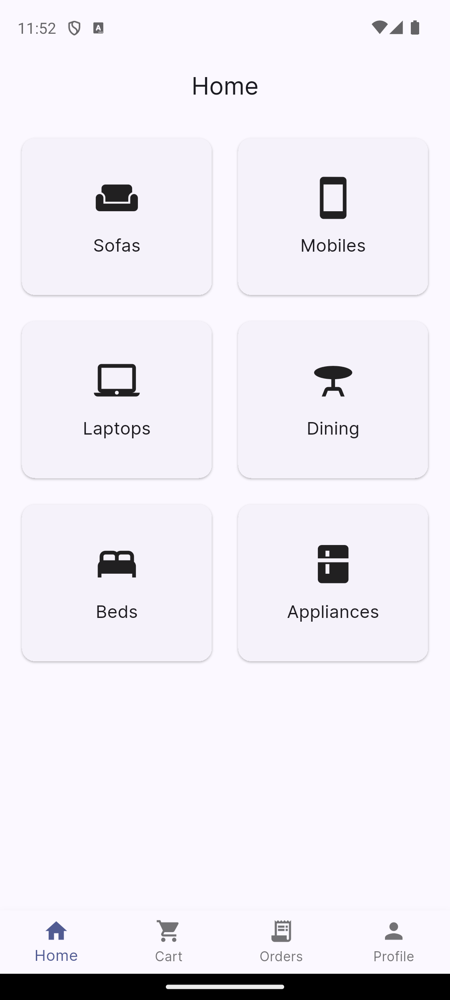

# Vaari - Modern E-Commerce Application

Vaari is a premium, feature-rich e-commerce application built with Flutter and Supabase. It offers a seamless shopping experience with built-in payments, order tracking, and a hidden administrative dashboard for store management.



## 🚀 Features

### **Customer Experience**
- **Dynamic Category Browsing**: Shop for Sofas, Mobiles, Laptops, Dining, Beds, and Appliances with ease.
- **Product Details & Highlights**: Comprehensive product information including descriptions and high-quality images.
- **Real-time Cart Management**: Add, remove, and update items in your cart with instant price calculations.
- **Secure Payments**: Integrated with **Razorpay** for safe and quick transactions.
- **Order Tracking**: View order history and real-time status updates (Pending, Paid, Shipped, Delivered).
- **PDF Invoices**: Generate and download PDF receipts for your orders.
- **Auth & Profiles**: Secure user authentication via Supabase and personalized user profiles.

### **Administrative Dashboard (Hidden)**
- **Secret Entry Point**: Access the admin panel by tapping the settings icon in the Profile tab 7 times rapidly.
- **Product Management**: Full CRUD operations for products (Add, Edit, View, Delete).
- **Order Management**: Monitor and update order statuses across the entire platform.
- **Database Security**: Robust Row Level Security (RLS) policies ensuring data integrity.

## 🛠️ Tech Stack

- **Frontend**: [Flutter](https://flutter.dev/) (SDK ^3.10.0)
- **State Management**: [Riverpod](https://riverpod.dev/) (v3.0.3)
- **Backend / DB / Auth**: [Supabase](https://supabase.com/)
- **Navigation**: [Go Router](https://pub.dev/packages/go_router)
- **Payments**: [Razorpay Flutter](https://pub.dev/packages/razorpay_flutter)
- **PDF Generation**: [pdf](https://pub.dev/packages/pdf) & [printing](https://pub.dev/packages/printing)
- **Local Storage**: [Shared Preferences](https://pub.dev/packages/shared_preferences)

## 📂 Project Structure

```text
lib/
├── core/               # Core utilities, constants, and themes
├── features/           # Feature-based modules
│   ├── admin/          # Admin dashboard (CRUD, Order mgmt)
│   ├── auth/           # Authentication logic & UI
│   ├── cart/           # Shopping cart functionality
│   ├── home/           # Main landing page & category grid
│   ├── orders/         # Order processing & history
│   ├── products/       # Product listing & details
│   └── profile/        # User profile & settings
├── routes/             # GoRouter configuration
├── shared/             # Common widgets used across features
└── app.dart            # Main application widget
```

## 🏁 Getting Started

### Prerequisites
- Flutter SDK installed
- Supabase account and project
- Razorpay API keys

### Setup

1. **Clone the repository**:
   ```bash
   git clone <repository-url>
   cd vaari
   ```

2. **Install dependencies**:
   ```bash
   flutter pub get
   ```

3. **Database Configuration**:
   Follow the detailed [DATABASE_SETUP_GUIDE.md](DATABASE_SETUP_GUIDE.md) to set up your Supabase tables and RLS policies.

4. **Run the Application**:
   ```bash
   flutter run
   ```

## 🔐 Administrative Access

The admin panel is protected and hidden from regular users:
- **How to Enter**: Navigate to `Profile` -> Tap `Settings (⚙️)` **7 times** within 2 seconds.
- **Default Password**: Consult the [ADMIN_PANEL_GUIDE.md](ADMIN_PANEL_GUIDE.md) for credentials.

## 📄 Documentation

- [Admin Panel Guide](ADMIN_PANEL_GUIDE.md)
- [Database Setup Guide](DATABASE_SETUP_GUIDE.md)

---
*Built with ❤️ by the Surya*
